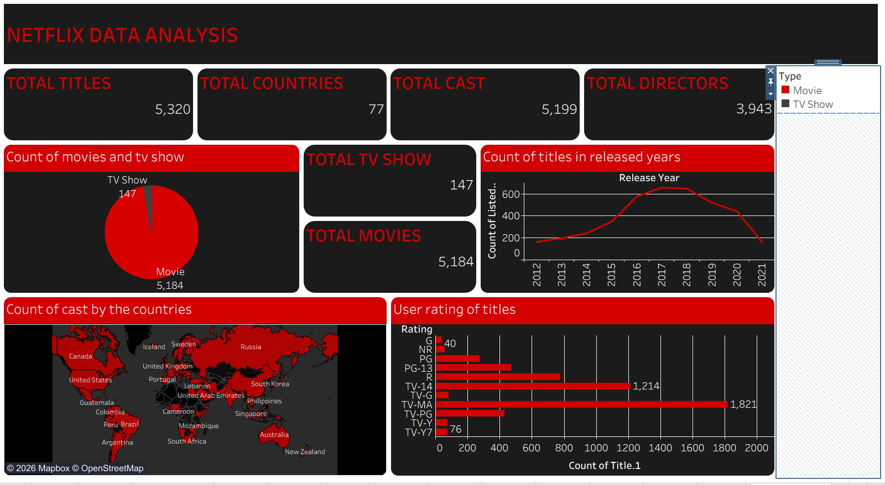

# 🎬 OTT Platform Analytics

An interactive Tableau project that analyzes content across popular OTT platforms. This repository aims to provide insights into movies and TV shows using interactive dashboards and visualizations.

## 📊 Current Dashboards
- ✅ Netflix Data Analysis
- ✅ Amazon Prime Video Analysis

## 🚧 Coming Soon
- Hotstar Analysis
- AppleTV Analysis
- Bollywood Analysis
- Hollywood Analysis

## 🛠️ Tools Used
- Tableau
- Microsoft Excel
- Data Cleaning & Data Visualization

## 📸 Dashboard Preview

### Netflix Dashboard

### Amazon Prime Video Dashboard

## 📌 Key Insights
- Content distribution by Movies and TV Shows
- Release year trends
- Ratings analysis
- Country-wise content availability
- Cast and director insights

> 🚀 More OTT platform dashboards and comparative analysis will be added soon.
