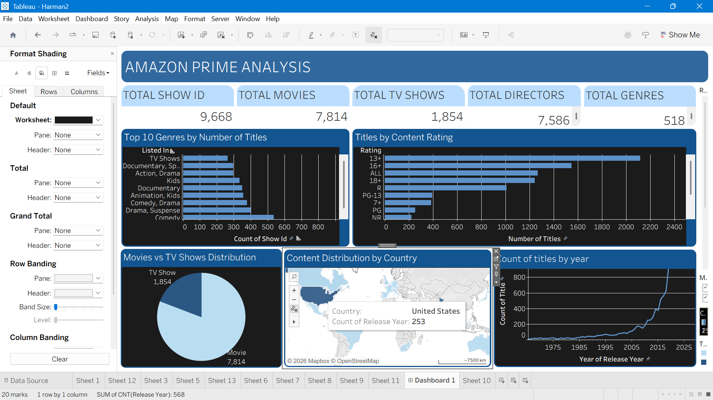

# OTT-Platform-Analystics
Developed an interactive Tableau dashboard to analyze OTT platform content. The dashboard provides insights into content type, genre distribution, ratings, release year trends, country-wise availability, and overall content statistics using interactive filters and visualizations.

# OTT-Platform-Analytics

Developed an interactive Tableau dashboard to analyze OTT platform content. The dashboard provides insights into content type, genre distribution, ratings, release year trends, country-wise availability, and overall content statistics using interactive filters and visualizations.

# OTT Platform Analysis Dashboard

## Dashboard Highlights

- Content Type Distribution (Movies vs TV Shows)
- Genre Analysis
- Release Year Trends
- Country-wise Content Availability
- Rating Distribution
- Interactive Filters for dynamic exploration
